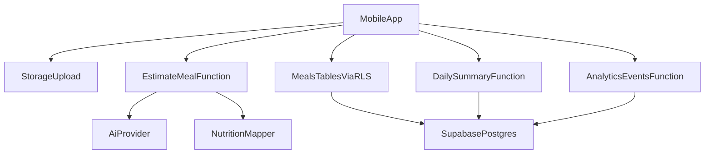

# Architecture

## High-Level

- `app` handles UI, capture flow, and local draft state.
- `supabase` handles auth, storage, SQL data, and edge functions.
- External AI provider runs behind server-side edge function.

## Module Boundaries

- Mobile feature modules:
  - `auth`
  - `onboarding`
  - `meals`
  - `camera`
  - `estimation`
  - `dashboard`
  - `analytics`
- Backend modules:
  - SQL tables + RLS policies
  - `estimate-meal` function
  - `daily-summary` function
  - `analytics-events` function
  - `cleanup-images` function

## Data Ownership Rules

- Meal totals are recomputed server-side.
- AI raw response stored for quality monitoring.
- Final meal save occurs only after user confirmation.
